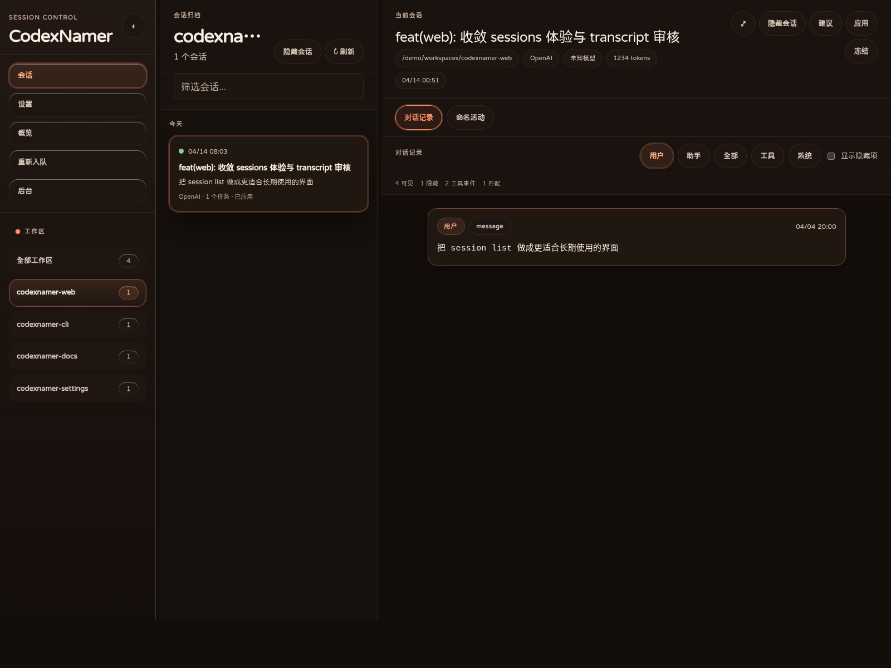
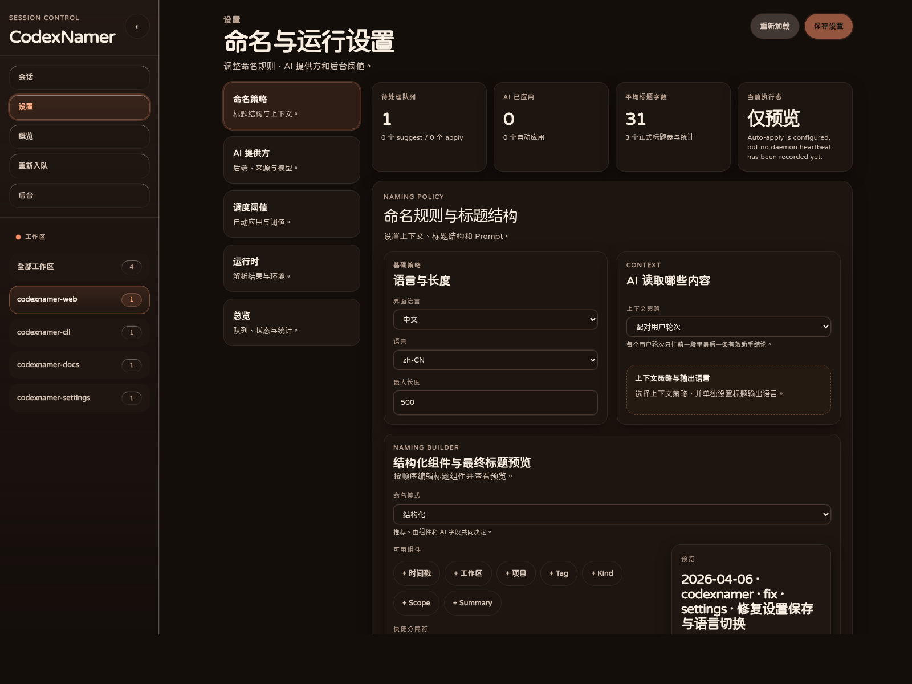

# sitJac/codex-session-manager

[English](README.md) | [简体中文](README.zh.md)

Keep Codex sessions readable on your own machine.

sitJac/codex-session-manager scans local Codex rollout history, suggests clearer session titles, lets you review or freeze them, and writes accepted names back through `~/.codex/session_index.jsonl` — without patching Codex itself.


## Screenshots

<table>
  <tr>
    <td width="50%">
      
    </td>
    <td width="50%">
      
    </td>
  </tr>
  <tr>
    <td valign="top">
      <strong>Sessions and transcript review</strong><br />
      Browse by workspace, inspect transcript, and review rename context without leaving the app shell.
    </td>
    <td valign="top">
      <strong>Settings and runtime controls</strong><br />
      Edit naming policy, provider setup, and runtime thresholds from one product surface.
    </td>
  </tr>
</table>

## What it does well

- **See all your sessions in one place** across workspaces, providers, and projects.
- **Generate clearer names** with reviewable, structured naming workflows.
- **Review before writing** with explicit `skip / suggest / apply` states.
- **Freeze noisy sessions** so stable names stay stable.
- **Run fully local-first** with its own SQLite state and official `session_index.jsonl` writeback.
- **Manage the whole flow in a product UI** with Sessions, Settings, Maintenance, Requeue, and Daemon views.

## Quick start

The GitHub repository is the primary distribution channel right now.

```bash
git clone https://github.com/sitJac/codex-session-manager.git codexnamer
cd codexnamer
npm install
npm run serve
```

Open:

- `http://127.0.0.1:42110`

`npm run serve` builds what it needs, starts one long-lived local process, serves the Web UI and the Local API together, and auto-starts the managed daemon unless you disable it explicitly.

## Conservative first-run setup

If you want a preview-only first run, copy the starter config before launching:

```bash
mkdir -p ~/.config/codexnamer
cp config.example.toml ~/.config/codexnamer/config.toml
```

That starter file is intentionally more conservative than the built-in defaults: it keeps `rename.auto_apply = "disabled"` until you trust the results.

## What you can do in the app

### Sessions

- browse sessions by workspace
- inspect transcript, metadata, and rename history
- review suggested titles before applying them
- apply, freeze, or requeue sessions when needed

### Settings

- adjust naming builder, tags, prompt override, and context strategy
- inherit Codex provider settings or define a manual provider
- verify provider connectivity and inspect resolved runtime configuration
- tune scan cadence, idle thresholds, and auto-apply policy

### Maintenance, Requeue, and Daemon

- review dirty queues, runtime charts, and AI request logs
- compact `session_index.jsonl` when it grows too large
- preview and execute rule-signature-based requeue
- watch the managed sweep daemon and control its runtime state

## Development and release checks

Current repository status:

- formatting and linting are unified on **Biome**
- `npm run lint` runs `biome check .`
- `npm run format` runs `biome format --write .`
- `npm run validate:full` is the release-grade verification entry

Typical contributor flow:

```bash
npm run lint
npm run build
npm run build:runtime
npm run web:build
npm test
```

## Background service

If you want sitJac/codex-session-manager to stay available as a user-level background service:

```bash
npm run cli -- service install --start
```

Other service commands:

```bash
npm run cli -- service status
npm run cli -- service restart
npm run cli -- service stop
npm run cli -- service uninstall
```

These service commands now print human-readable summaries by default, with terminal colors enabled automatically on TTY output. Add `--json` if you need machine-readable output for scripts, or `NO_COLOR=1` if you want plain text.

Platform mapping:

- Linux → `systemd --user`
- macOS → `LaunchAgent`
- Windows → Task Scheduler (`ONLOGON`)

## Configuration

Default user config path:

- `~/.config/codexnamer/config.toml`

Optional project override path:

- `<current working directory>/.codexnamer.toml`

sitJac/codex-session-manager can inherit provider settings from your local Codex config, or you can define a manual provider inside sitJac/codex-session-manager.

## Other ways to operate

Most users only need `npm run serve`, but the project also includes:

- `npm run tui` — terminal UI backed by the Local API
- `npm run cli -- ...` — direct command-line operations
- `npm run api -- --host 127.0.0.1 --port 42110` — Local API only
- `npm run daemon -- --once` — standalone sweep runner for isolated testing

## Documentation

- Release-facing overview and quick start: `README.md` / `README.zh.md`
- User and contributor docs: [`docs/README.md`](docs/README.md)
- Security policy: [`SECURITY.md`](SECURITY.md)
- Contribution guide: [`CONTRIBUTING.md`](CONTRIBUTING.md)

## Reference projects

- [`nameIsNoPublic/cli-history-hub`](https://github.com/nameIsNoPublic/cli-history-hub) — a useful reference for Codex session history browsing, sidecar metadata, and awareness of `session_index.jsonl` / `thread_name`.

## Friends

[](https://linux.do/)

## Why local-first matters

sitJac/codex-session-manager keeps its own state, but final rename writeback still goes through the official `session_index.jsonl` layer. That gives you:

- a tool you can inspect and control yourself
- no Codex source patching
- a clear separation between Codex internals and sitJac/codex-session-manager state
